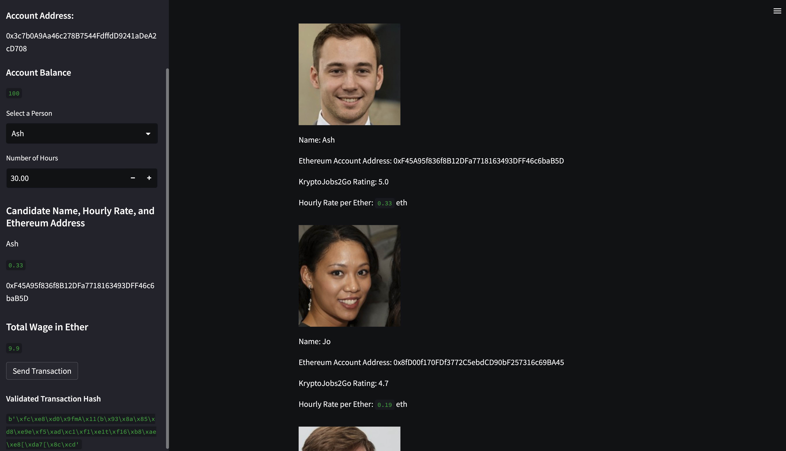

# Assignment 19: Crypto Jobs

## In this section I am going to demonstrate the results of my findings as per the Assignment.

## Initial Run

### Before the initial run of the streamlit app I have changed the Ethereum account address of "Ash" with whom i am going to place the order so that the account activity can be motitored directly in Ganache

### In the initial run we will send a transaction by using the KryptoJobs2Go application. The resul is shown the image below.

